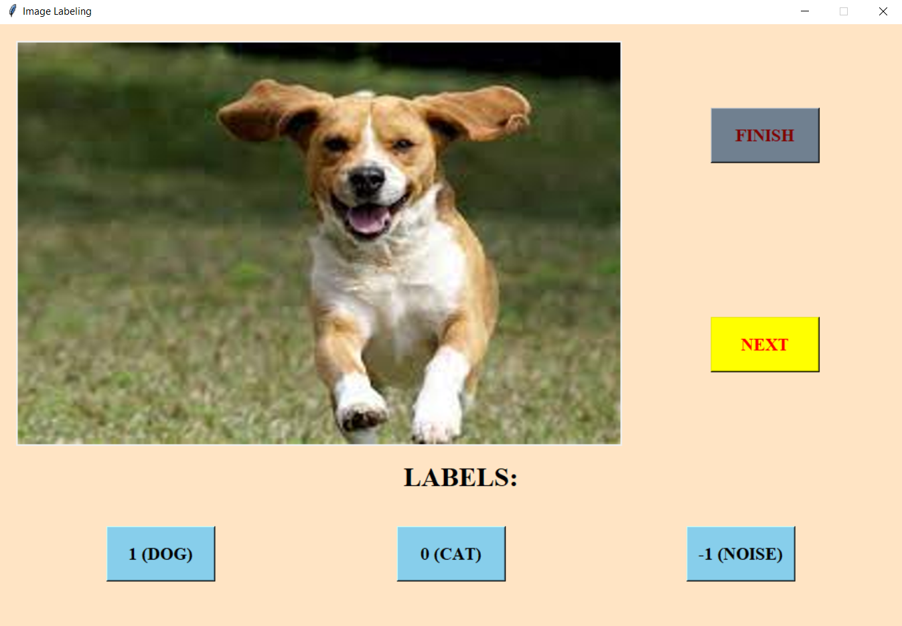

# ImageLabeling
Labeling data for classification problem


## Installation
Use git clone to install app

```bash
git clone https://github.com/thinh53105/ImageLabeling.git
```

## Requirements
Install some libraries to run this app

```bash
pip install -r requirements.txt
```

## Usage
Push all images you want to label into **"images"** directory, 
then adjust some parameters in **image_labeling.py** and run this file


